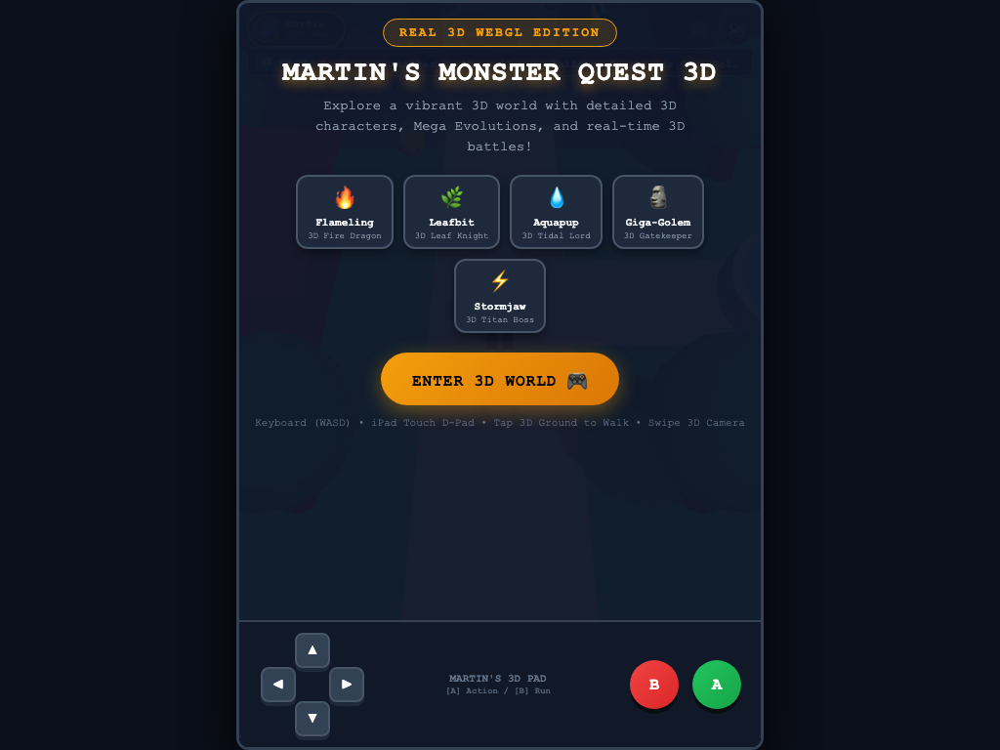
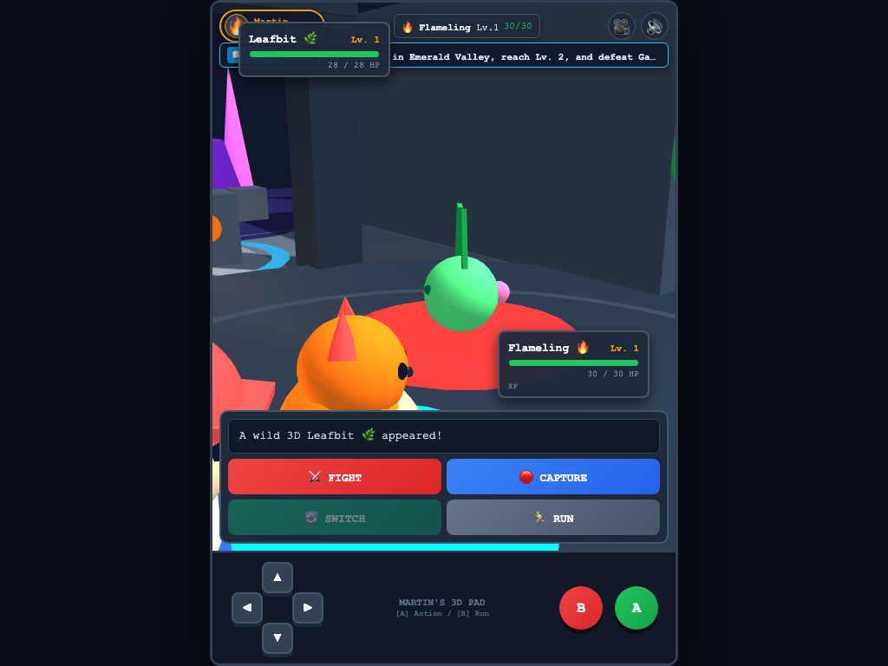
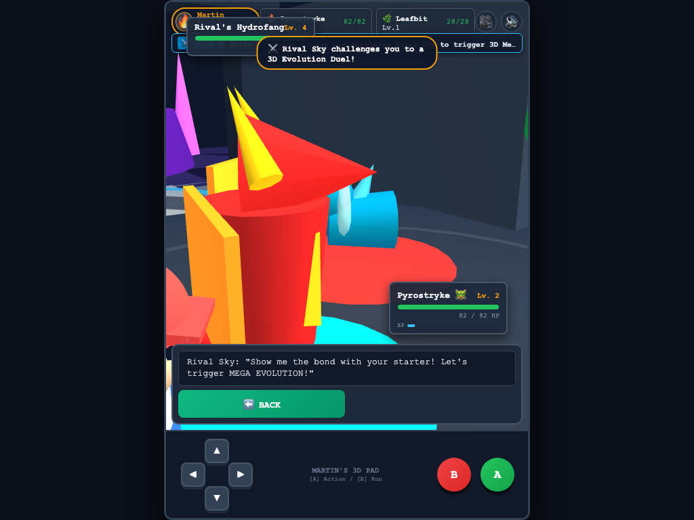
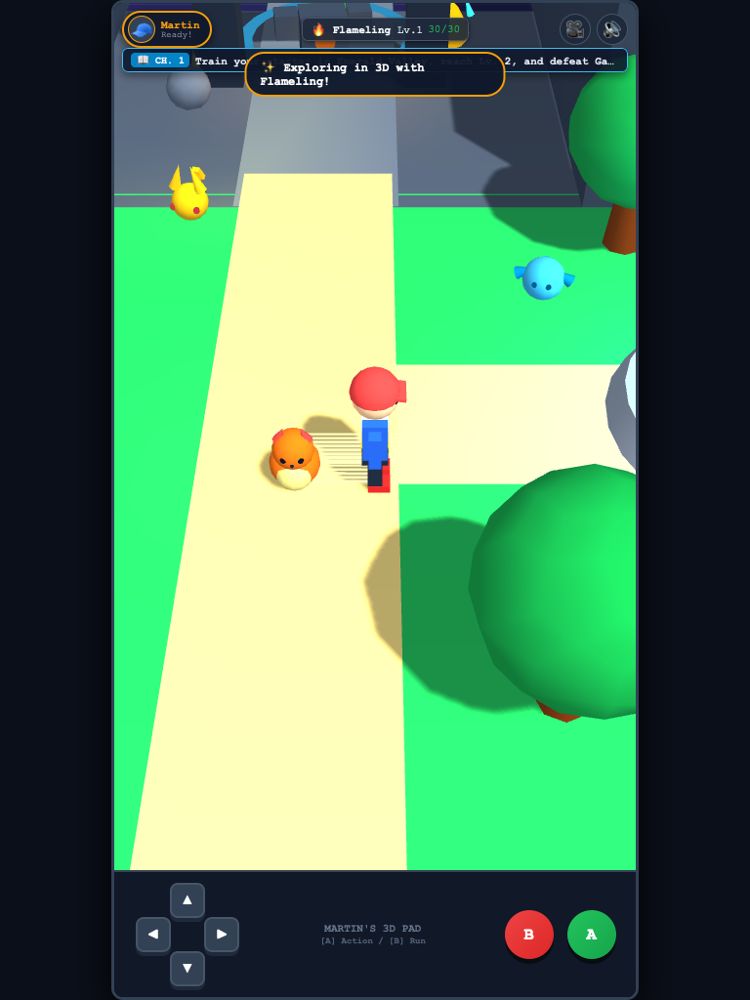
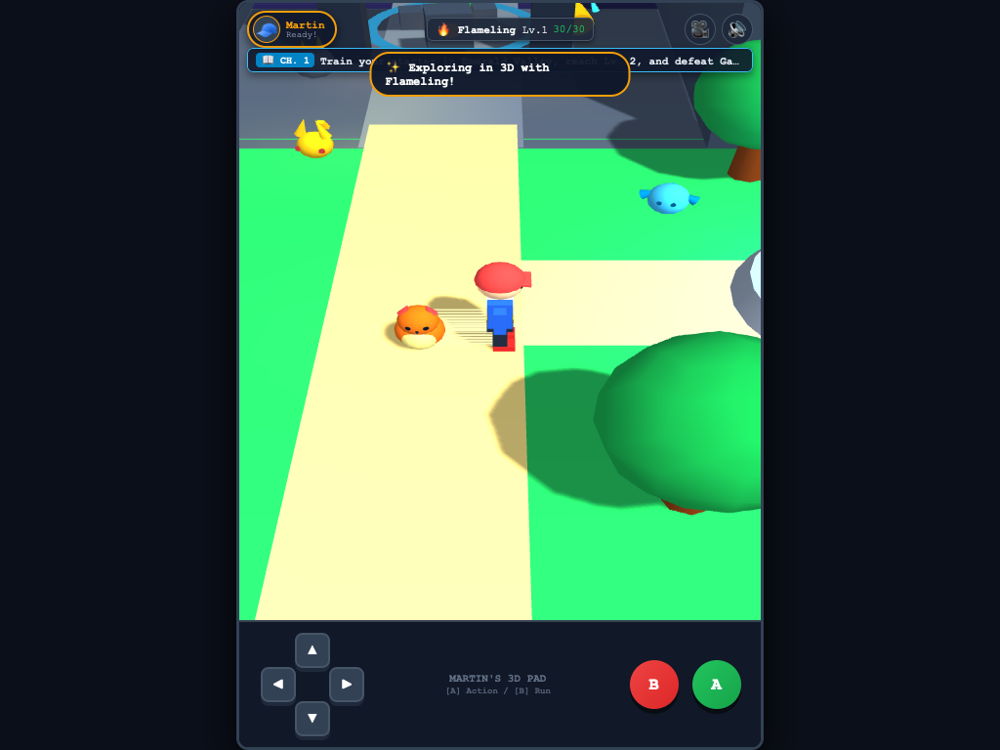

# 2026-09-17 独立终版验收证据

对应代码提交：`dcf81db4e47c10a98f83180e2d3a615d8f0d795b`。

先读 [CLASSROOM_HANDOFF.md](../../../CLASSROOM_HANDOFF.md)。

[结构化实测结果](results.json)。测试方法与未测边界见交接文档；这些图片来自独立浏览器，WebKit图片不是实体iPad证明。

## martin-title.png

## martin-battle.png

## martin-no-legal-move.png

## martin-webkit-portrait.png

## martin-webkit-landscape.png

